# こもれび ユーザーガイド

こもれびは、不安障害・適応障害・双極性障害を抱える方のための、長期伴走型メンタルケアアプリです。

「使わなきゃ」ではなく、「使いたいときに開ける」場所。
記録できた日も、できない日も、どちらの自分もここにいて大丈夫です。

---

## はじめかた

### アカウントを作る

メールアドレスとパスワードだけで登録できます。本名は不要です。

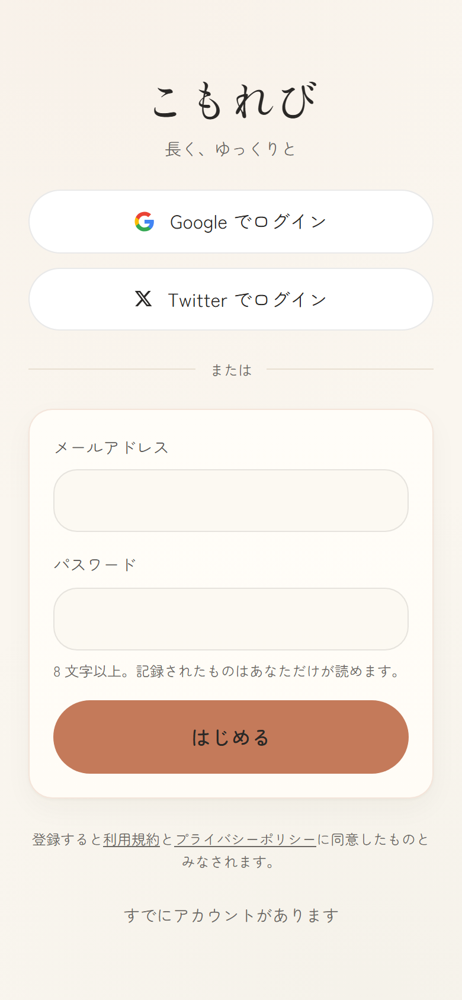

### オンボーディング

3つのステップで、簡単な自己紹介と約束ごとを確認します。
すべてスキップ可能で、あとからいつでも変更できます。

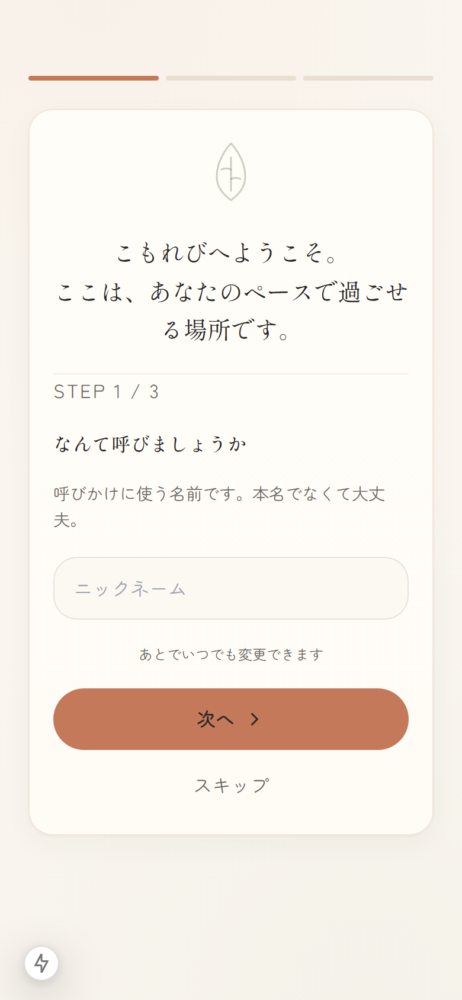

### ログイン

登録済みの方は、メールアドレスとパスワードでログインできます。

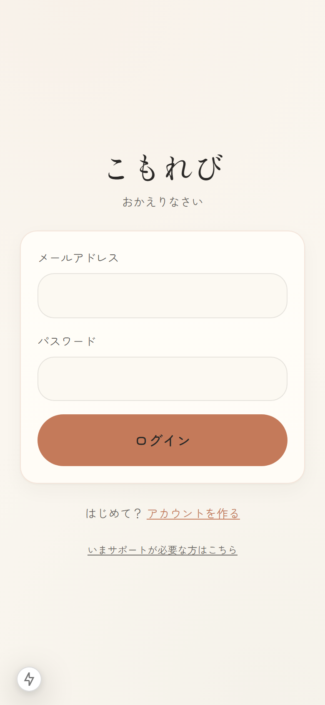

---

## ホーム画面

ログインすると、今日の体調を記録するカードと、気を整えるためのショートカットが並びます。

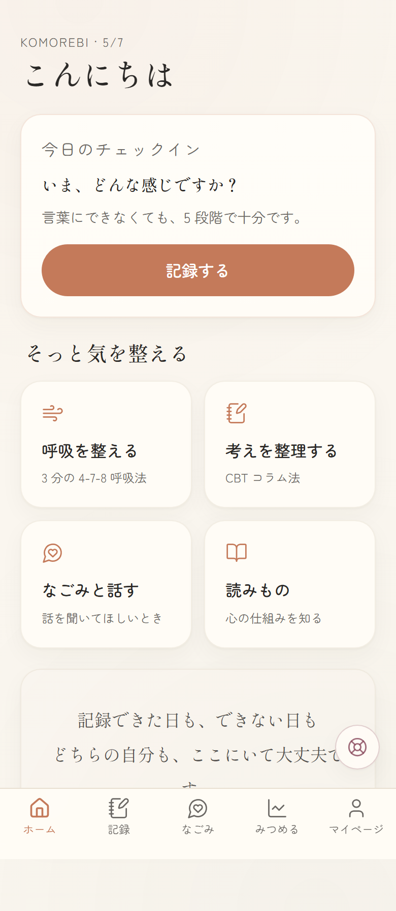

気分を記録すると、ホーム画面に「今日の体調」が反映されます。

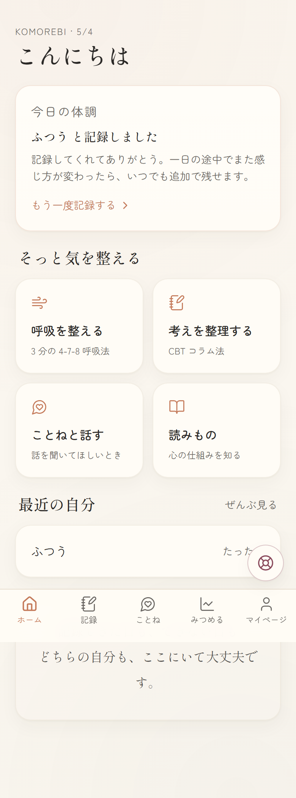

---

## 記録する

「記録」タブから、3種類の記録方法を選べます。
どれを残すかは、その日の自分次第。順番もありません。

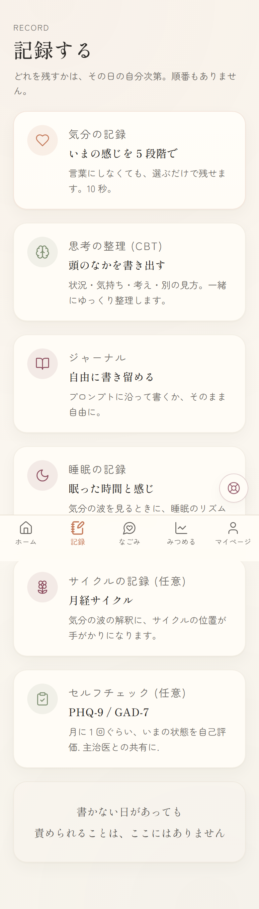

### 気分の記録

5段階の気分とエネルギーを選ぶだけ。10秒で終わります。
関係しそうなタグ（睡眠、仕事、通院日など）も選べます。

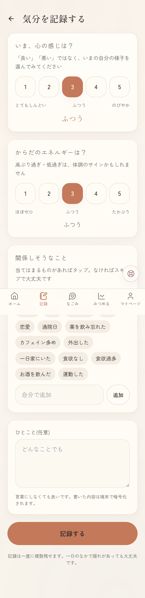

### 思考の整理（CBT コラム法）

認知行動療法のコラム法をベースに、9つのステップでゆっくり考えを整理します。
途中までで終えても、また続きから書けます。

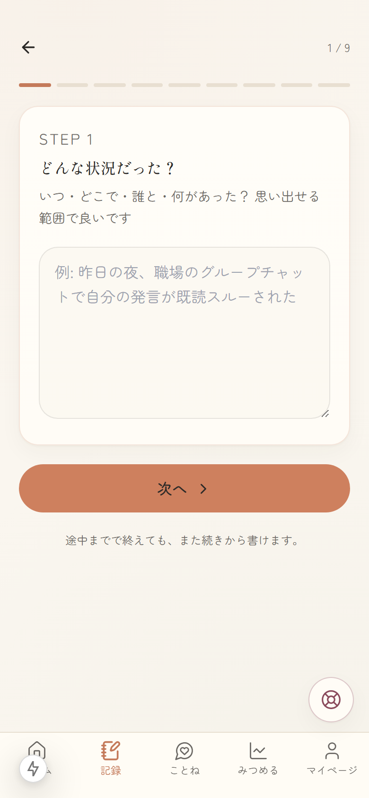

### ジャーナル

自由に書き留める場所です。書きにくい日のために、30種類のプロンプト（お題）を用意しています。
プロンプトはリフレッシュボタンで別のものに変えられます。

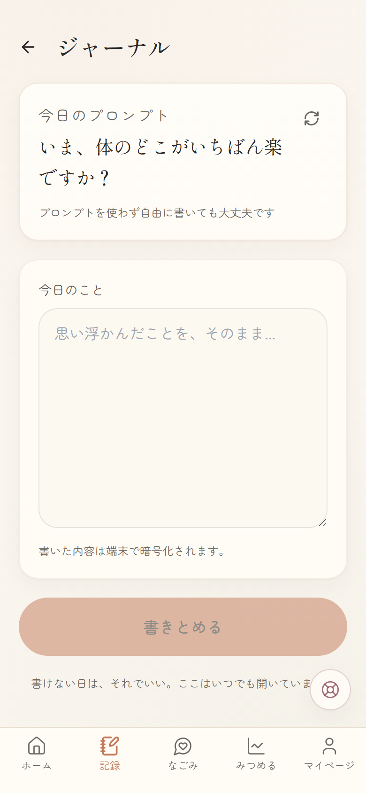

> 書けない日は、それでいい。ここはいつでも開いています。

---

## ことね（AI チャット）

「ことね」は、あなたの話を聞くための AI です。
診断や治療はできませんが、どんなことでも、ゆっくりで大丈夫です。

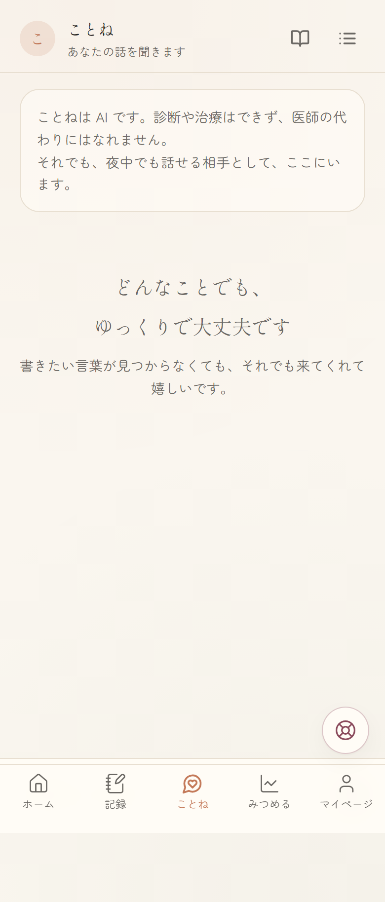

ことねは:
- あなたの話を否定しません
- 診断名を断定しません
- 薬について意見しません
- 「治る」「悪化する」といった予言をしません
- AIであることを聞かれたら正直に答えます

### 会話はスレッドで管理

話題ごとに会話を分けて、それぞれの続きからいつでも再開できます。
ヘッダーの一覧アイコンから、過去の会話を選べます。

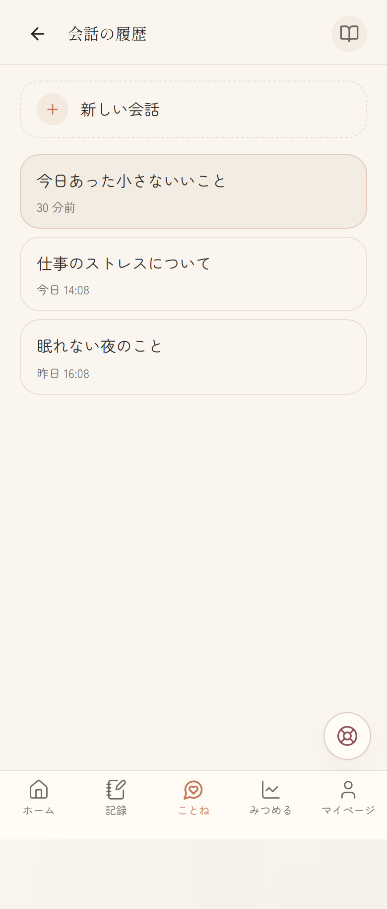

例えば「仕事のストレス」と「眠れない夜」を別々のスレッドで話せます。

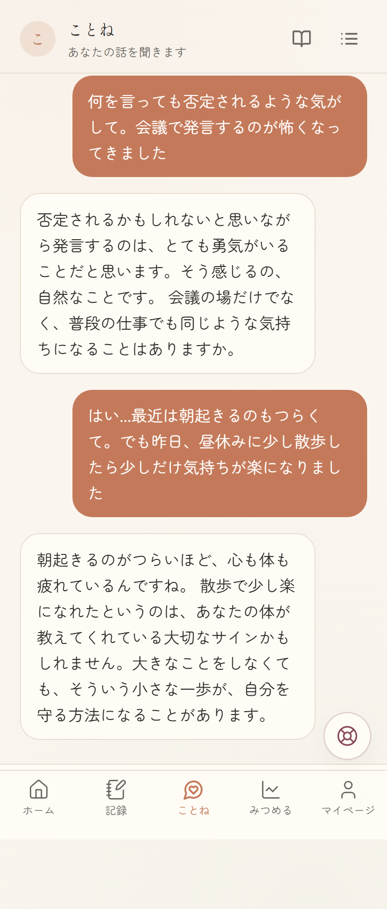

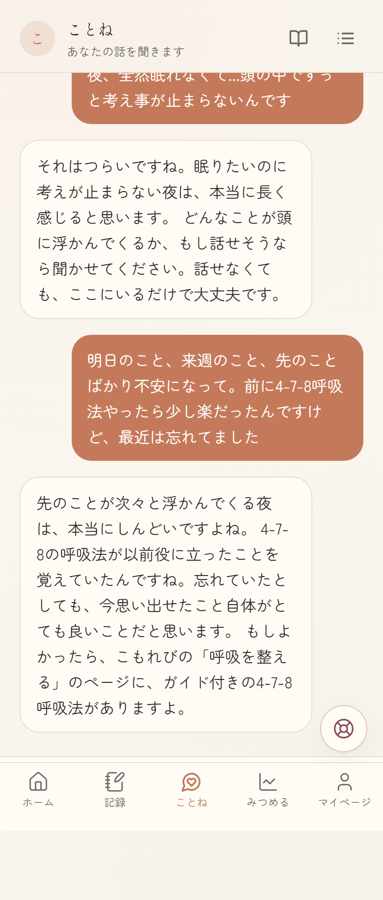

### ことねノート

会話を重ねるうちに、ことねはあなたのことを少しずつ覚えていきます。
助けになったこと、しんどくなりやすい場面、話し方の好みなど。

覚えていることはすべて「ことねノート」で確認できます。
間違っていたり、忘れてほしいことはいつでも消せます。
自分で「覚えていてほしいこと」を追加することもできます。

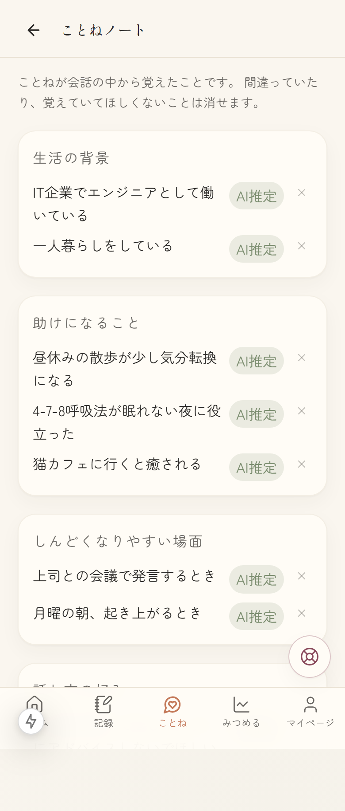

---

## みつめる（グラフ）

気分とエネルギーの推移を、30日または90日のグラフで眺められます。

「良い」「悪い」の評価はありません。自分のリズムを、ただ眺めてみてください。

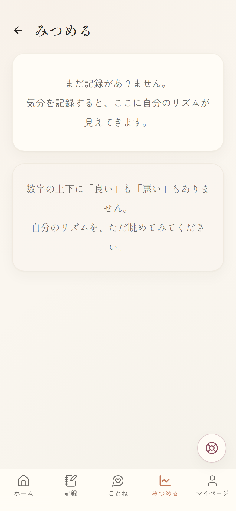

---

## 呼吸を整える

3つのエクササイズから選べます。完璧にやる必要はありません。途中でやめても大丈夫です。

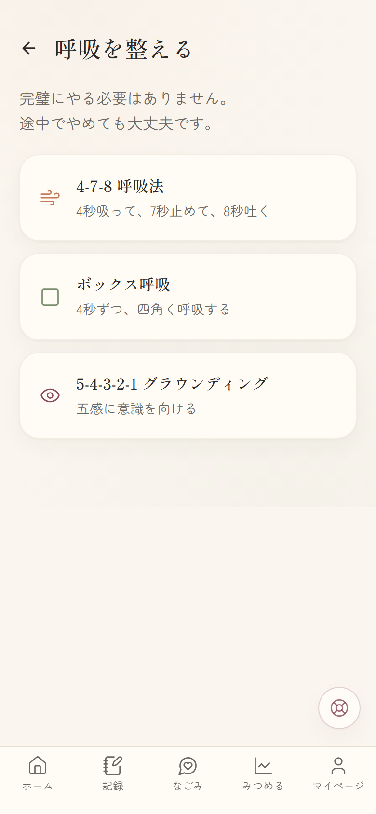

- **4-7-8 呼吸法** - 4秒吸って、7秒止めて、8秒吐く
- **ボックス呼吸** - 4秒ずつ、四角く呼吸する
- **5-4-3-2-1 グラウンディング** - 五感に意識を向ける

---

## 読みもの

「治す」ではなく「付き合う」視点で書かれた、5つの記事を読めます。

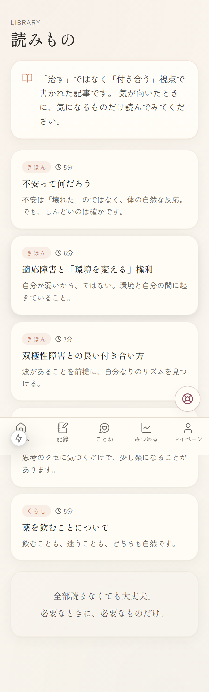

### 不安って何だろう

不安は「壊れた」のではなく、体の自然な反応。でも、しんどいのは確かです。

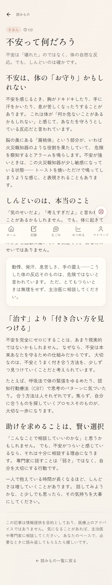

### 適応障害と「環境を変える」権利

自分が弱いから、ではない。環境と自分の間に起きていること。

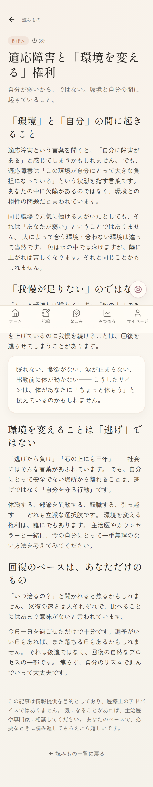

### 双極性障害との長い付き合い方

波があることを前提に、自分なりのリズムを見つける。

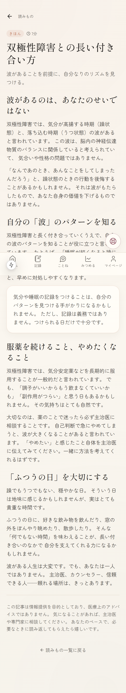

### 認知の歪みカタログ

思考のクセに気づくだけで、少し楽になることがあります。

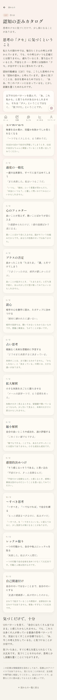

### 薬を飲むことについて

飲むことも、迷うことも、どちらも自然です。

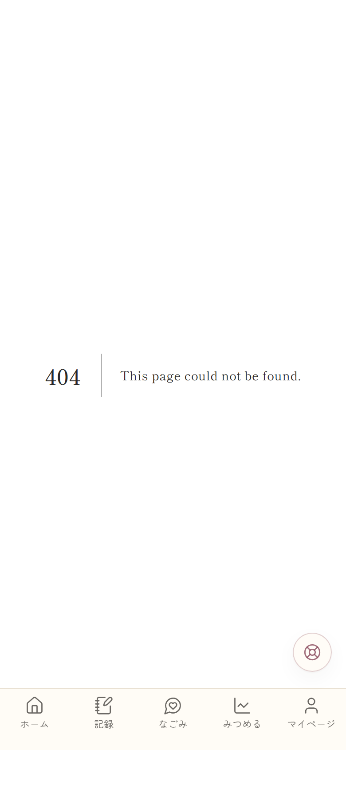

---

## 服薬の記録

お薬の名前・用量・タイミングを登録して、飲めた日・飲めなかった日を記録できます。

飲み忘れを責めることは、ここにはありません。

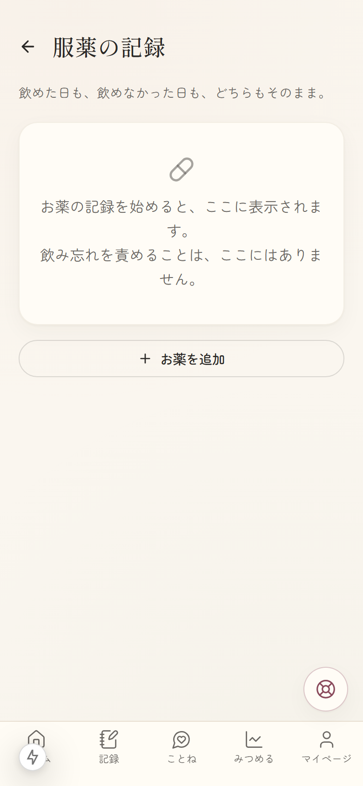

---

## コミュニティ

ハートだけで気持ちを伝え合う、ゆるやかな場所です。
コメント機能はありません。そっと寄り添う場所です。

現在はクローズドベータで検証中です。

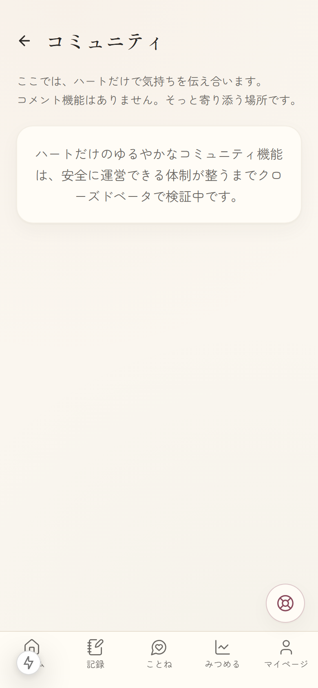

---

## マイページ

通院の記録、通知設定、セキュリティ、データの管理などにアクセスできます。

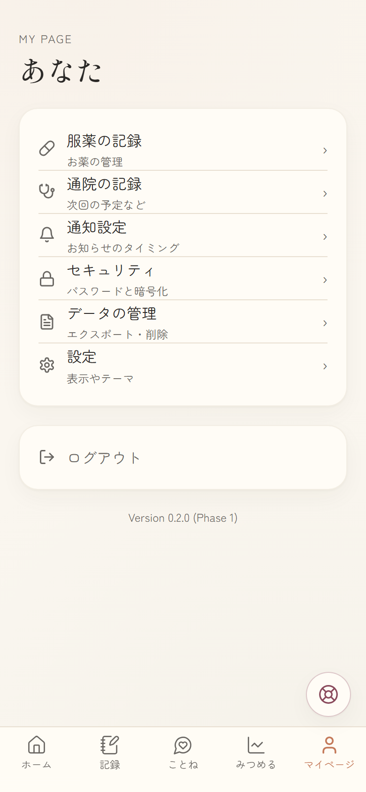

---

## 緊急サポート

ログインしていなくても、いつでもアクセスできます。
画面下の赤いボタン、または `/crisis` から直接開けます。

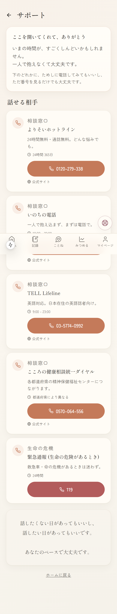

つらいときは、一人で抱え込まず、以下に電話してみてください:

- **よりそいホットライン**: 0120-279-338（24時間無料）
- **いのちの電話**: 0570-783-556
- **命の危険があるとき**: 119

---

## 大切なお約束

- こもれびは医師の代わりにはなれません。気になることは主治医に相談してください
- 続けられない時期があっても大丈夫です。あなたを責めません
- 書いたものはあなたのもの。いつでも消せます
- 合わないと感じたら、離れていいです。それも自分を大切にすることです

---

*このアプリは「使う人の人生に長く寄り添う」ことが目的です。*
*5年後にも変わらず安心して開ける場所でありたいと思っています。*
