# こもれび ユーザーガイド

こもれびは、不安障害・適応障害・双極性障害を抱える方のための、長期伴走型メンタルケアアプリです。

「使わなきゃ」ではなく、「使いたいときに開ける」場所。
記録できた日も、できない日も、どちらの自分もここにいて大丈夫です。

---

## はじめかた

### アカウントを作る

メールアドレスとパスワードで登録できます。本名は不要です。
Google や X (Twitter) のアカウントでもログインできます。

### オンボーディング

3つのステップで、簡単な自己紹介と約束ごとを確認します。
すべてスキップ可能で、あとからいつでも変更できます。

### ログイン

登録済みの方は、メールアドレスとパスワード、または Google / X でログインできます。

### パスワードを忘れたとき

ログイン画面の「パスワードを忘れた方」から、リセットメールを送信できます。

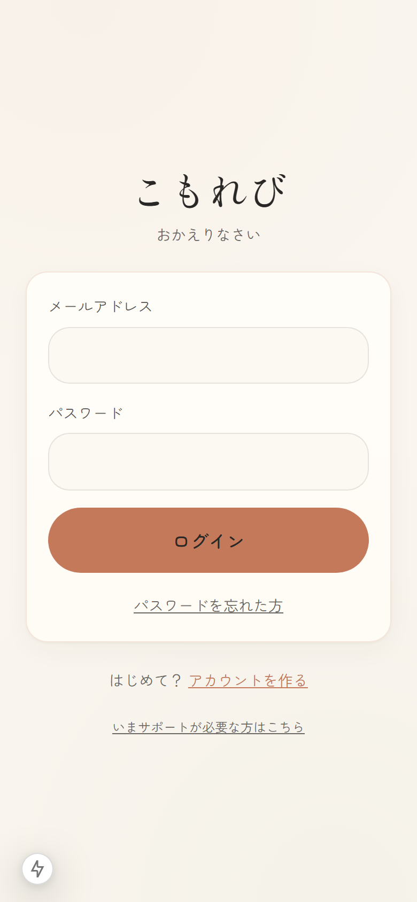

### ホーム画面に追加

iOS Safari の共有メニューから「ホーム画面に追加」、Android の Chrome のメニューから「アプリをインストール」で、PWA としてインストールできます。
ホーム画面のアイコンから直接起動できるようになります。

---

## ホーム画面

ログインすると、今日の体調を記録するカードと、気を整えるためのショートカットが並びます。
チャット相手の名前は **なごみ** です。

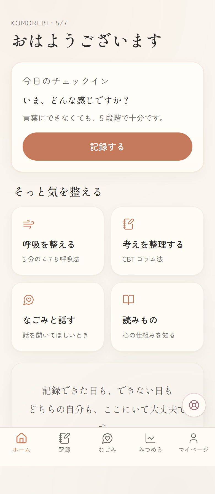

気分を記録すると、ホーム画面に「今日の体調」が反映されます。

---

## 記録する

「記録」タブから、複数の記録方法を選べます。
どれを残すかは、その日の自分次第。順番もありません。

### 気分の記録

5段階の気分とエネルギーを選ぶだけ。10秒で終わります。
関係しそうなタグ（睡眠、仕事、通院日など）も選べます。

### 思考の整理（CBT コラム法）

認知行動療法のコラム法をベースに、ステップ形式で考えを整理します。
過去に書いた記録は一覧で見返せて、タップで詳細表示。

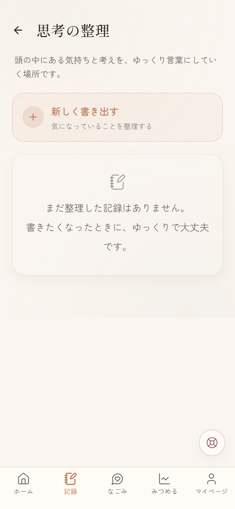

途中までで終えても、また続きから書けます。

### ジャーナル

自由に書き留める場所です。書きにくい日のために、30種類のプロンプト（お題）を用意しています。
プロンプトはリフレッシュボタンで別のものに変えられます。

> 書けない日は、それでいい。ここはいつでも開いています。

### 睡眠の記録

寝た時刻・起きた時刻・眠りの感じ (1-5) を残せます。気分の波と並べて見ると、双極性のサインや不調のリズムが見えてきます。

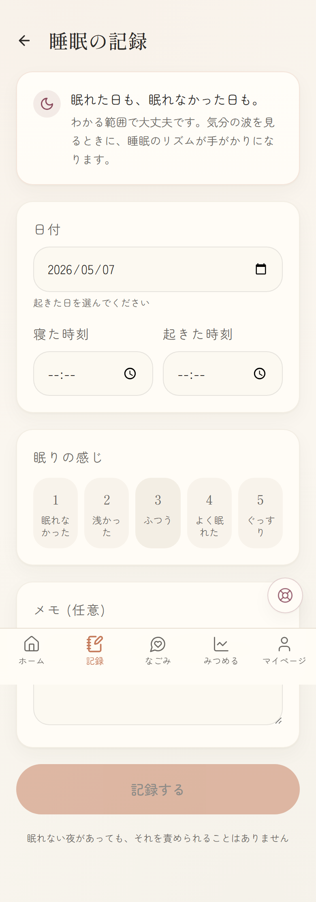

### サイクルの記録 (任意)

月経サイクルと気分の波は関係していることがあります。生理開始日を記録すると、推定位相 (生理中・卵胞期・排卵期・黄体期) がインサイト画面で見られます。

opt-in なので、設定 OFF のまま使うこともできます。OFF にすればこの機能は表示されません。

有効化後は、いまの推定位相と直近の記録を確認できます。

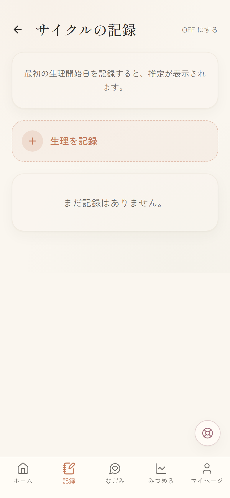

### セルフチェック (PHQ-9 / GAD-7)

世界中で使われている標準化スケールでこころの状態を自己評価できます。
**診断ではなく**、自分の経過を主治医や相談窓口と共有するときの記録として使います。月に 1 回くらいが目安です。

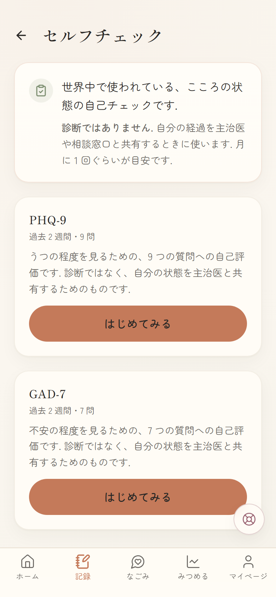

1 問ずつ進む形式で、過去 2 週間を振り返って 4 段階で答えます。

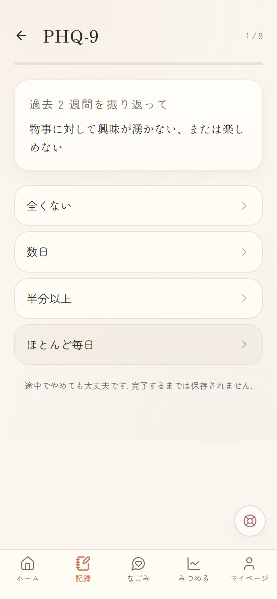

PHQ-9 で「自分を傷つけたい」気持ちが見えたときは、結果画面にサポートと **セーフティプラン** への導線が出ます。

---

## なごみ（AI チャット）

「なごみ」は、あなたの話を聞くための AI です。
診断や治療はできませんが、どんなことでも、ゆっくりで大丈夫です。

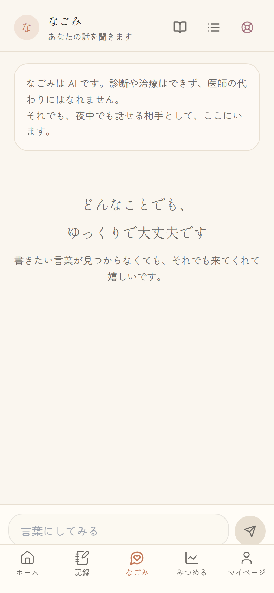

なごみは:
- あなたの話を否定しません
- 診断名を断定しません
- 薬について意見しません
- 「治る」「悪化する」といった予言をしません
- AIであることを聞かれたら正直に答えます

### 会話はスレッドで管理

話題ごとに会話を分けて、それぞれの続きからいつでも再開できます。
ヘッダーの一覧アイコンから、過去の会話を選べます。

例えば「仕事のストレス」と「眠れない夜」を別々のスレッドで話せます。

### なごみノート

会話を重ねるうちに、なごみはあなたのことを少しずつ覚えていきます。
助けになったこと、しんどくなりやすい場面、話し方の好みなど。

覚えていることはすべて「なごみノート」で確認できます。
間違っていたり、忘れてほしいことはいつでも消せます。
自分で「覚えていてほしいこと」を追加することもできます。

---

## みつめる（グラフと気づき）

気分とエネルギーの推移を、30日または90日のグラフで眺められます。

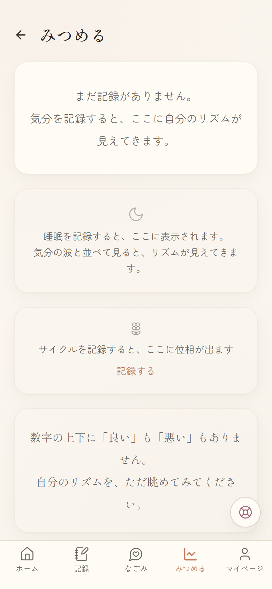

- 「気づき」: 14 日以上記録があると、気分とタグ・曜日・直近トレンドの傾向をやわらかく出します。「断定」ではなく「傾向があるかも」のトーンです
- 睡眠サマリ: 平均の長さと感じ、直近 7 件の記録
- サイクルサマリ: opt-in 有効時のみ、いまの推定位相と次回予定
- よく選ばれたタグ

「良い」「悪い」の評価はありません。自分のリズムを、ただ眺めてみてください。

---

## 呼吸を整える

3つのエクササイズから選べます。完璧にやる必要はありません。途中でやめても大丈夫です。

- **4-7-8 呼吸法** - 4秒吸って、7秒止めて、8秒吐く
- **ボックス呼吸** - 4秒ずつ、四角く呼吸する
- **5-4-3-2-1 グラウンディング** - 五感に意識を向ける

---

## 読みもの

「治す」ではなく「付き合う」視点で書かれた、5つの記事を読めます。

### 不安って何だろう

不安は「壊れた」のではなく、体の自然な反応。でも、しんどいのは確かです。

### 適応障害と「環境を変える」権利

自分が弱いから、ではない。環境と自分の間に起きていること。

### 双極性障害との長い付き合い方

波があることを前提に、自分なりのリズムを見つける。

### 認知の歪みカタログ

思考のクセに気づくだけで、少し楽になることがあります。

### 薬を飲むことについて

飲むことも、迷うことも、どちらも自然です。

---

## 服薬の記録

お薬の名前・用量・タイミングを登録して、飲めた日・飲めなかった日を記録できます。

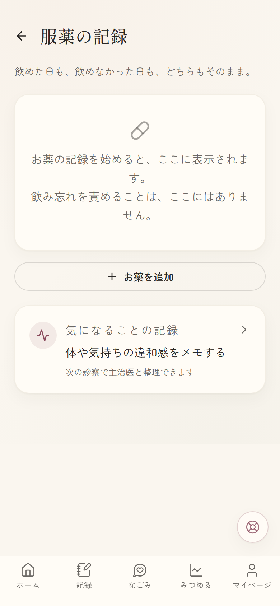

### 薬の名前のサジェスト

精神科でよく処方される薬 (抗うつ薬・抗不安薬・気分安定薬・抗精神病薬・睡眠薬・ADHD治療薬・漢方など 60 種以上) を商品名・一般名でサジェストします。
入力しながら候補をタップするだけで登録できます。

### 気になることの記録 (副作用)

薬を飲んでいて気になる体や気持ちの変化を記録できます。
「副作用かどうかの判断は主治医と一緒に」がスタンス。眠気・口渇・体重変化・性機能・感情の薄さなど 24 種類のカテゴリから選べます。

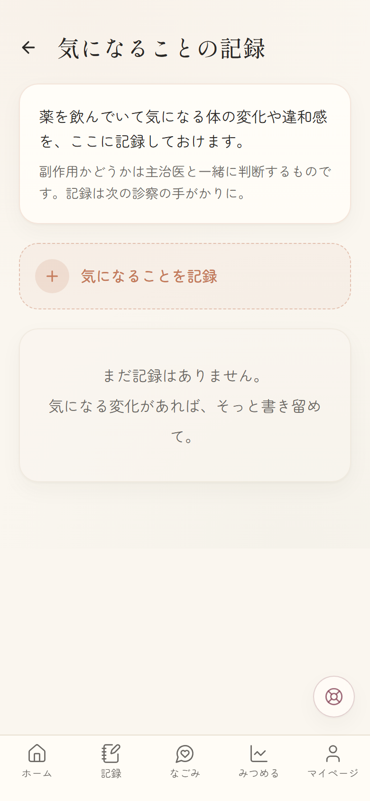

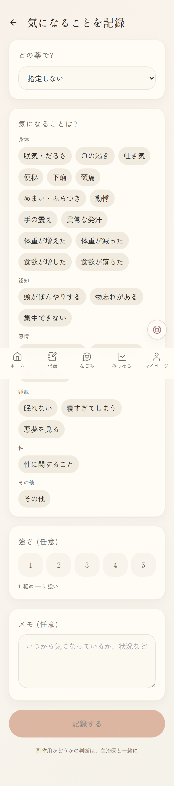

> 飲み忘れを責めることは、ここにはありません。

---

## 緊急サポートとセーフティプラン

ログインしていなくても、いつでもアクセスできます。
画面右下のサポートアイコン、または `/crisis` から直接開けます。

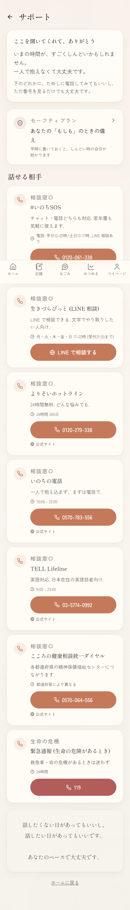

### セーフティプラン (Stanley-Brown 6 ステップ)

平時に書いておくと、しんどい時の自分が助かります。海外の研究で自殺念慮の再発を有意に下げることが示されている、evidence-based な方法です。

6 つのステップ:
1. **警戒サイン** — こころが下に向かう兆候 (思考・気持ち・身体感覚・行動)
2. **自分でできる対処** — ひとりでできる気を逸らす方法
3. **気を逸らせる人や場所** — 深刻な話をしなくても一緒にいられる相手や場所
4. **助けを求められる人** — しんどい話をしてもいい人 (連絡先も)
5. **専門家・相談窓口** — 主治医・カウンセラー・相談ダイヤル
6. **安全な環境を作る** — 衝動に流されないための環境調整

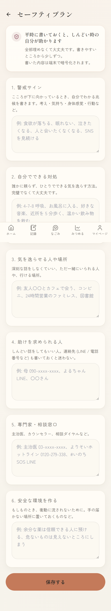

書いた内容は端末で暗号化されます。全部埋めなくて大丈夫。書きやすいところから少しずつ。

### 相談窓口

つらいときは、一人で抱え込まず、以下に連絡してみてください:

- **#いのちSOS**: 0120-061-338 (電話) / LINE 相談 — 若年層向け
- **生きづらびっと**: LINE 相談 — 文字でやり取りしたい人向け
- **よりそいホットライン**: 0120-279-338（24時間無料）
- **いのちの電話**: 0570-783-556
- **命の危険があるとき**: 119

---

## マイページ

通院の記録、主治医共有レポート、通知設定、セキュリティ、データの管理などにアクセスできます。

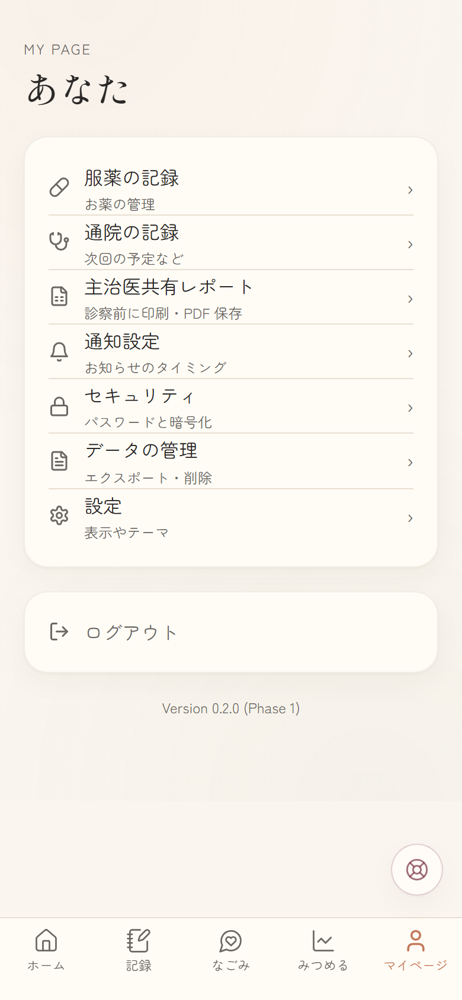

### 表示名の変更

「設定」から表示名 (ホーム画面で挨拶される名前) を変更できます。Google / X / Credentials すべてのログイン方式に対応。

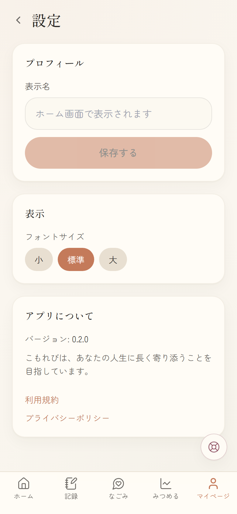

### 主治医共有レポート (PDF)

直近 30 日のサマリ (気分・睡眠・服薬遵守・PHQ-9/GAD-7・通院・副作用) を 1 枚にまとめて表示します。
ブラウザの「PDF として保存」または「印刷」ボタンから、診察前に共有できる形で保存できます。

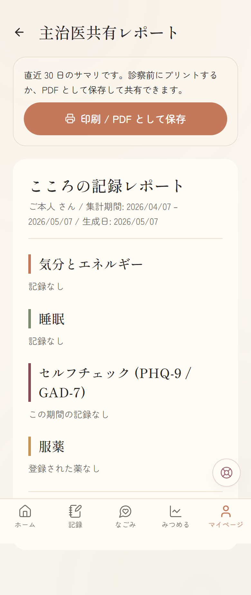

短い診察時間の中で、データを見ながら主治医と整理する手がかりになります。

### データの管理

すべての記録を JSON ファイルとしてダウンロードできます。
アカウントの削除もここから行えます。削除すると、すべてのデータが完全に消去されます。

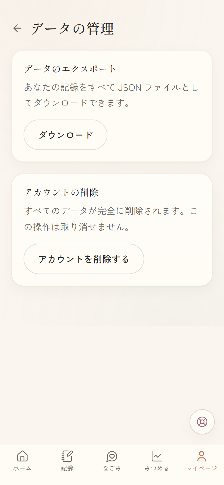

---

## 利用規約・プライバシーポリシー

ログインしていなくても確認できます。

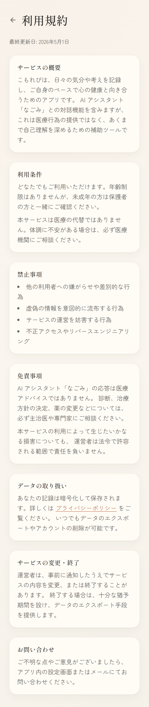

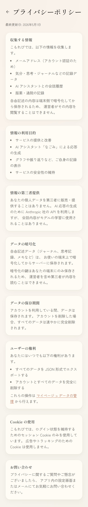

---

## 大切なお約束

- こもれびは医師の代わりにはなれません。気になることは主治医に相談してください
- 続けられない時期があっても大丈夫です。あなたを責めません
- 書いたものはあなたのもの。いつでもエクスポート・削除できます
- 合わないと感じたら、離れていいです。それも自分を大切にすることです

---

*このアプリは「使う人の人生に長く寄り添う」ことが目的です。*
*5年後にも変わらず安心して開ける場所でありたいと思っています。*
